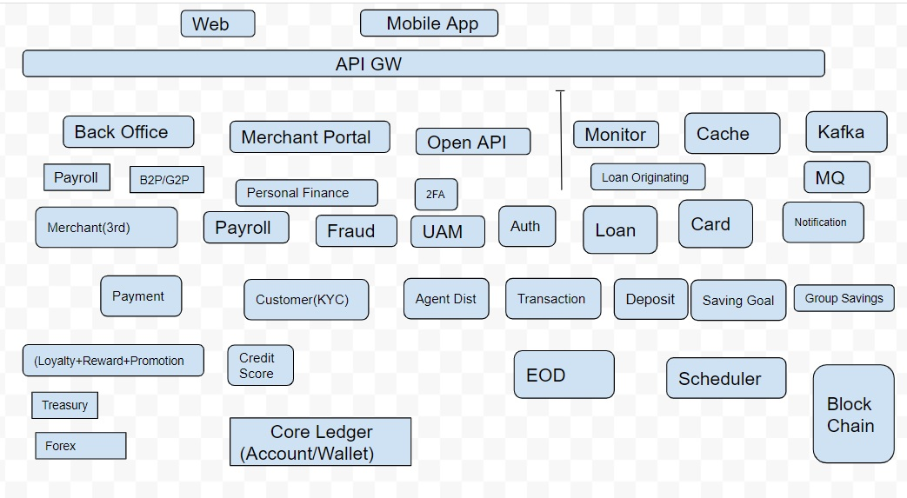

## LoogNi FinTech (LooFi)

LoogNi FinTech (LooFi) is an Open Source Cloud Native FinTech Platform for Digital wallet, Digital Payment & Digital Bank.
We provide open source and enterprise fintech platform and consultation to any tech company.

 
## Our Product:
- Open Source Cloud Native FinTech building blocks
- Open Source Digitla Wallet
- Open Source Payment System
- Open Source Digital Banking Platform
- Open Source Mobile Banking
  

## Our Service:
- Product Development Partner
- Customization & Enhancement
- Implementation 
- Consultation
- Support
- Training
- Service Integration/Orchestration
- Implement Security, Regulatory control and Auditing 
- Implement monitoring and observability 
- Optimization, Performance Improvement and Scalability Support
 

## Industries
- Bank
- FinTech 
- MFI/MFS
- Mobile Banking
- e-Wallet/Digital Wallet
- Payment Platform
- BNPL
- Virtual Card
- WealthTech
- Digital Banking
- Neo Banking
- Open Banking
- Lending 
- Investment
- Payment Processor
- Any tech company who want to receive, store and disburse money
- Embedded finance
- BaaS (Bank as a Service)  

## Architecture

## Service Components (Building Blocks) 
- Account/wallet & Ledger System (Scalable ledger & balance and transaction system for holding, receiving & sending money) 
- Back Office/Administrative Operation
- Virtual Card (Debit/Credit)
- Notification (OTP,SMS,Email,Push)
- Loyalty (Loyalty Management cash back and loyalty points)
- Event & ticket Management
- Authentication & Authorization
- Payment / Merchant System
- Open (Banking) API / B2B API
- Payment Gateway 
- Third Party Integration service module
- Customer KYC
- Deposit/Savings
- Group Savings
- Credit/Lending
- Asset Management & Trading (Stock, Bond, Token) 
- Agent & Distribution Channel Management
- Credit Scoring
- Payroll 

## Demo
- [White Lebel Mobile App](https://github.com/LogNi-FinTech/mobile-app-screen/blob/main/README.md)
- [BackOffice (core-account-ui) Web Interface](https://github.com/LogNi-FinTech/account-core-ui-screen/blob/main/README.md)
- API Doc

### Contact
Email: lognifintech@gmail.com
